<h1>
  
  CENG795 HW4: Fancy Wrapping Paper
</h1>

From now on this will be the blog space since I do not want to have limited png like I did in metu blog. So hello from a new link!

This homework is focused on textures and how to implement them. It includes perlin noise, checkerboard, mipmapping, normal replacement, bump mapping and interpolation.

In my previous blogs I could not write to my will because of upload limitations so here it is. This blog will contain a lot more details about my implementation and debugging process.

Behold, pictures.


---
# Texture Maps

To add texture maps into my raytracer, I first created a dedicated folder than shoved every code into a single file (as one does).

I created the following Texture class to work with as a base:
```c++
class Texture
{
public:
    virtual ~Texture() = default;
    uint32_t _id;
    DecalMode decalMode;
    real bumpFactor = 1.0;
    Texture(uint32_t i, DecalMode d) : _id(i), decalMode(d){}
    virtual Color TextureColor(const Vertex& vert, Texel& tex, real level) = 0;
    virtual TextureType getTextureType() = 0;
    virtual bool IsMipMapped() { return false; }
};
```

TextureColor gets the color of the texture at a certain point.
Since I use texel for images and vertex for others I pass both. 
Which is not efficient if texel is not being used because it is computed either way.
Level is passed specifically for mipmapping.

## Using Texture
To be able to use the textures, I added four texture pointers to my abstract object class.
One for each: 

- diffuse: replace_kd
- specular: replace_ks
- normal: replace_normal and bump_normal
- all: replace_all

This also means I am not accumulating textures in the case of an object having several texture of the same type. 
It is possible to implement that, but not needed as I believe this makes more sense.

I also added several functions to the object class:
- GetColourAt: The colour computation is now completely handled at the object class. 
This function is called after shadow testing is done. If there is a `replace_all` texture, then even shadow testing and ambient lighting is skipped.
- (virtual) getTexel: Returns texel coordinates of a vertex according to the time (if there is motion blur).
- (virtual) getBitan: this function computes the T and B vectors. I struggled quite a bit to make this correct for the triangles.
- computeBitan: For triangles and planes I initially compute their tangents since theirs' don't change. For this purpose I have this function to pre-compute.
- getTexturedNormal: this is called in every getNormal function right before returning. Only manipulates the normal if there is a normal texture. Will be talked more about in displacement mapping section.


## ImageTexture

Coding the image has several layers:

### 1. Image class
```c++
struct MipMap
{
    int width, height;
    std::vector<std::vector<Color>> colorData;
};

class Image
{
public:
    uint32_t _id;
    int channels_in_file;
    std::vector<MipMap> mipmaps;
    std::string filename;
    Image(uint32_t id, std::string filename);
    ~Image();
    void CreateMipMap();
};
```
Image class is quite straightforward. 
I hold the filename for printing purposes. 
The main part is the mipmap vector. 
I will only talk about the non-mipmap cases in this section. 
For those, I put a single MipMap within the vector.

Now you might realize that I am holding colordata as a color vector instead of a char array. 
That is because while loading the texture I simply fill that array for the ease of coding.

```c++
uint32_t curr_idx = 0;
m0.colorData.resize(m0.height, std::vector<Color>(m0.width));
for (int y = 0; y < m0.height; y++)
{
    for (int x = 0; x < m0.width; x++)
    {
        m0.colorData[y][x] = Color(data[curr_idx], data[curr_idx+1], data[curr_idx+2]);
        curr_idx += 3;
    }
}
mipmaps.push_back(m0);
```

This is open to improvement since currently I only store the RGB. 
If the channel number is different and I need that information then I will not be able to use it. 
But no issue for now, let's continue with loading the image.

### 2. Loading the texture image
For this purpose I used the stb library and the function `stbi_load`. It is important to add the header to the folder and include it as follows:
```c++
#define STB_IMAGE_IMPLEMENTATION
#include "stb_image.h"
```
Works flawlessly. 
Though I did have an issue when I tried to store data pointer in the Image class. 
There would be a segfault everytime at the exact place where the Image class constructor would return. 
I did not solve this issue as I asked to myself "Do I even need the pointer?". Which I didn't, so I removed it. 
I assume I need to deep copy it for it to work. Which is kind of what I already do with my colorData vector.


### 3. ImageTexture class
Finally, the class itself with all its glory.

```c++
class ImageTexture : public Texture
{

private:
    Interpolation interpolation;
    real normalizer;
    Image *image;
    ImageTexture(uint32_t id, DecalMode d, Image *image, Interpolation interp, real normalizer);
    Color nearest(Texel texel, real level);
    Color bilinear(Texel texel, real level);
    Color trilinear(Texel texel, real level);
    std::function<Color(Texel,real)> interpolate;

public:
    Color ImageColor(int x, int y, int level, bool wrap = false);
    
    Color TextureColor(const Vertex& vert, Texel& tex, real level) override;
    TextureType getTextureType() override;
    bool IsMipMapped() override { return interpolation == Interpolation::TRILINEAR; }
};
```
There are a few things to unpack here. So let's go step by step.

**TextureColor:**
This is the virtual function from the Texture class. 
The actual work is being done by the interpolation functions.
This is where I apply tiling and normalizer. The normalizer is 255 by default.
```c++
Texel tiled = {fmod(tex.u,1.0), fmod(tex.v,1.0)};
Color interpolated_color = interpolate(tiled, level);
return  interpolated_color / normalizer;
```

**ImageColor:**
This function gets an x and y coordinate on the image and returns the colour of it. 
X and y are clamped to prevent out of bounds access.


**Interpolation (nearest and bilinear):** 
This is the big part.
I hold the interpolation as an std::function which is set to be one of the three interpolation functions within the class.
I then call the interpolation function whenever I want and skip the if-elses or switches. Looks cleaner.

To be honest, I did have a hard time getting the interpolations exact. Mine would always be off a bit. Their final exact versions are below:
```c++
Color ImageTexture::nearest(Texel texel)
{
    Texel xy = {(real) fmod(tex.u,1.0) * (image->mipmaps[level].width), 
                (real) fmod(tex.v,1.0) * (image->mipmaps[level].height)};
    return ImageColor(std::round(xy.u - 0.5), std::round(xy.v - 0.5), level);
}
```
As you might realize, I subtract 0.5 from both x and y. That is because we need to round it to the nearest pixel's **center**, not its corner vertex.
Now please don't think that I thought of it from the get-go. No. No I sadly did not.


```c++
Color ImageTexture::bilinear(Texel tex, real level)
{
    Texel xy = {(real) fmod(tex.u,1.0) * (image->mipmaps[level].width), 
                (real) fmod(tex.v,1.0) * (image->mipmaps[level].height)};

    Texel pq = {std::floor(xy.u), std::floor(xy.v)};
    Texel delta = {xy.u - pq.u, xy.v - pq.v};
    Color result = ImageColor(pq.u,     pq.v,     level) * (1 - delta.u) * (1 - delta.v)
                 + ImageColor(pq.u + 1, pq.v,     level) * (delta.u)     * (1 - delta.v)
                 + ImageColor(pq.u,     pq.v + 1, level) * (1 - delta.u) * (delta.v)
                 + ImageColor(pq.u + 1, pq.v + 1, level) * (delta.u)     * (delta.v);
    return result;
}
```
Funnily enough, bilinear interpolation was more straightforward for me. 

I will talk about trilinear interpolation function separately.

### Debugging
<p align="center">
  
  <figcaption></figcaption>
</p>

Not a great start.

The problem was how I was converting the texels to the image texels. Spoiler: I wasn't. 
That is why all I got the very first pixel. This issue was mainly is about the interpolation functions. And this line I forgot the add initially:
```c++
Texel xy = {(real) fmod(tex.u,1.0) * (image->mipmaps[level].width), 
            (real) fmod(tex.v,1.0) * (image->mipmaps[level].height)};
```
Multiplying with the width and height is what makes it span across the whole texture. 
In addition, thinking exact width or height would be out-of-bounds, I tried to multiply with `width-1` yet this resulted in a slightly zoomed effect. 
So I settled with clamping.

The image textures were mostly complete after this. Mipmapping has its own section.

## Checkerboard
This is quite cute compared to the image texture. Holds a black colour, a white colour, scale and offset. Has a `IsOnWhite` function that is called by texture colour function. 
Look at the beauty, the simplicity. I of course managed to make a mistake.

```c++
Color CheckerTexture::TextureColor(const Vertex& vert, Texel& tex)
{
    return IsOnWhite(vert) ? whiteColor : blackColor;
}

bool CheckerTexture::IsOnWhite(real i)
{
    real place = (i + offset) * scale;
    return ((int) std::floor(place) & 1) == 1;
}

bool CheckerTexture::IsOnWhite(Vertex vert)
{
    bool xorXY = IsOnWhite(vert.x) != IsOnWhite(vert.y);
    return xorXY == IsOnWhite(vert.z);
}
```

Initially the isOnWhite(real i) would perform the following:
```c++
    real place = (i + offset) * scale;
    return ((int) std::floor(place) % 2) == 1;
```

Which resulted in this in VeachAjar:


To be honest I fixed it by trial and error and didn't really get what was wrong in the initial one at first. Apparently it is about the negative values. When I take the modulo, the result stays negative if the initial value is negative. This of course leads to more "false"s when I check for `== 1`.

(It is very cruel to  put checkerboard as an image texture in simpler scenes and fooling me into thinking the noise version worked on the first try.)

Also I would like to note that I am using the global vertex here instead of localizing it or using the texel.

With VeachAjar I realized the existence of normalizer aspect. Before that, I was dividing by 255 regardless of any input.

<p align="center">
  
  <figcaption></figcaption>
</p>

After dividing by the normalizer the scene was fixed. 
Instead of showing the final picture 
I will show my sampling which is actually from previous homework. 
Mine are the ones on the left.

Side note: I still have not perfected my dielectrics but did not have time to check that this homework.


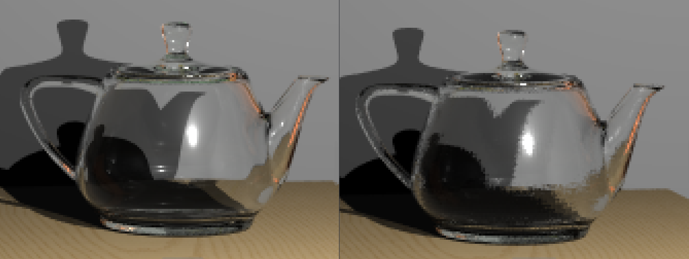


## Perlin Noise
I implemented the perlin noise class from https://mrl.cs.nyu.edu/~perlin/noise/.
Did not add much myself, simply adapted it to my code by creating a static PerlinNoise class.

My Perlin Texture class holds the scale and the octaves of the noise. 
And a converter function which either takes the absolute of the resulting noise or linearly squishes it to [0,1].
```c++
real pow_2__i = 1.0, result = 0.0;
Vertex vert2 = vert * NoiseScale;
int pow_2_i = 1;
for (int i = 0; i < NumOctaves; i++)
{
    real perlin_res = PerlinNoise::perlin(vert2.x * pow_2_i, vert2.y * pow_2_i, vert2.z * pow_2_i);
    result = result +  pow_2__i * perlin_res;
    pow_2_i = pow_2_i << 1;
    pow_2__i *= 0.5;
}
result = convertNoise(result) / amplitude;
return Color(result, result, result);
```

Let's see what is the initial result I got after coding.

Now this, this is not correct. I don't know if you can tell.

<p align="center">
  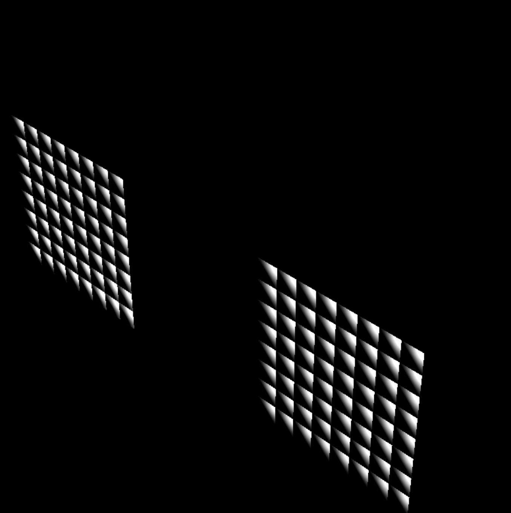
  <figcaption></figcaption>
</p>

Probably if you squint. Anyways turns out I forgot to initialize the perlin noise function which randomizes the P array.
Also, I forgot to call my convertNoise function.

<p align="center">
  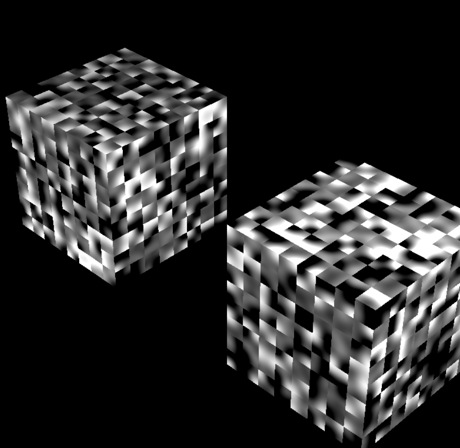
  <figcaption></figcaption>
</p>

Ah yes, a lot more familiar.

I then changed the fade function to be in the website rather than the slides and voila!

<p align="center">
  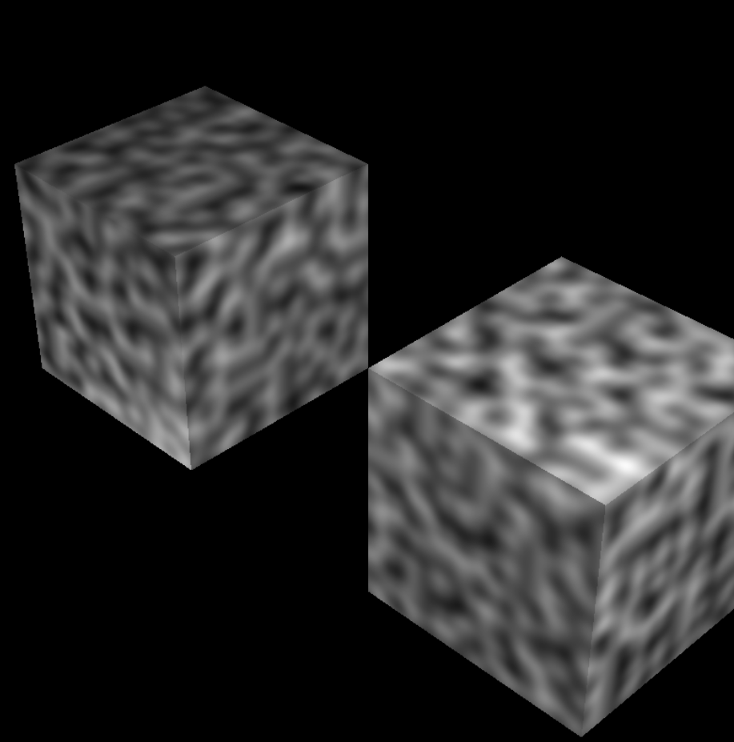
  <figcaption></figcaption>
</p>

Now, you can see that there is no difference between absolute and linear. Let me present you the reason:
```c++
if (funcname == "absval)")return Convert::Abs;
if (funcname == "linear)")return Convert::Linear;
return Convert::Linear;
```
Truly a work of art in terms of mistakes. After this the result had no issue.


Bonus: During debugging of VeachAjar scene I tried to localize global instance vertices which lead to this 
(The perlin noise looks "flat"):

<p align="center">
  
  <figcaption></figcaption>
</p>

I also wanted to try something and changed my absolute value function to return the negative of its result. I am mentioning this because I believe the result looked really cool.
<p align="center">
  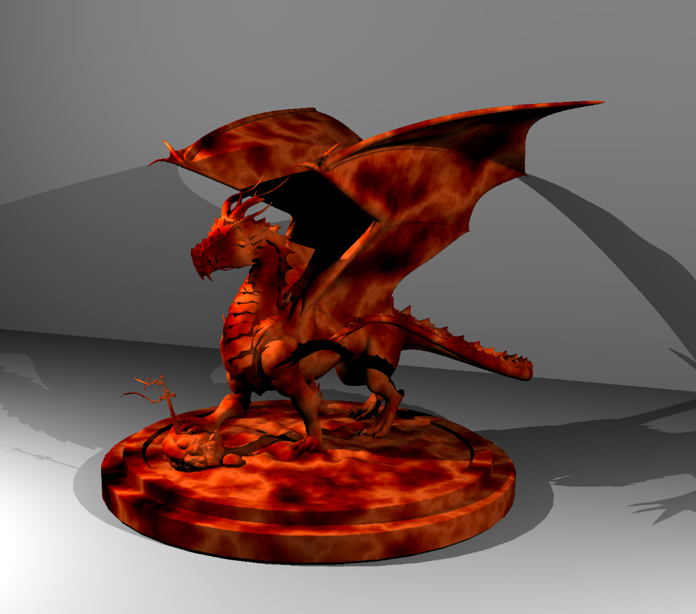
  <figcaption></figcaption>
</p>
I was debugging because my dragon's colours more vibrant than the reference.
<p align="center">
  
  <figcaption></figcaption>
</p>
I sadly could not find the reason to this. Maybe due to this scene having more than one octaves.

## Colours
You already saw the results of this but let me quickly mention the implementation.

The normalization assumes that the result is in expected kd or ks interval.

- **Diffuse:** Either replace kd with the fetched texture colour or `kd = (kd + tex_col)/2.0`.
- **Specular:** Replace ks.
- **Background:** Multiply the result with 255. Compute the texels according to the pixel x and y values.
- **Replace all:** Multiply the result with 255. No shading no ambient.

Below is a version with perlin noise background that I tried just to see.

<p align="center">
  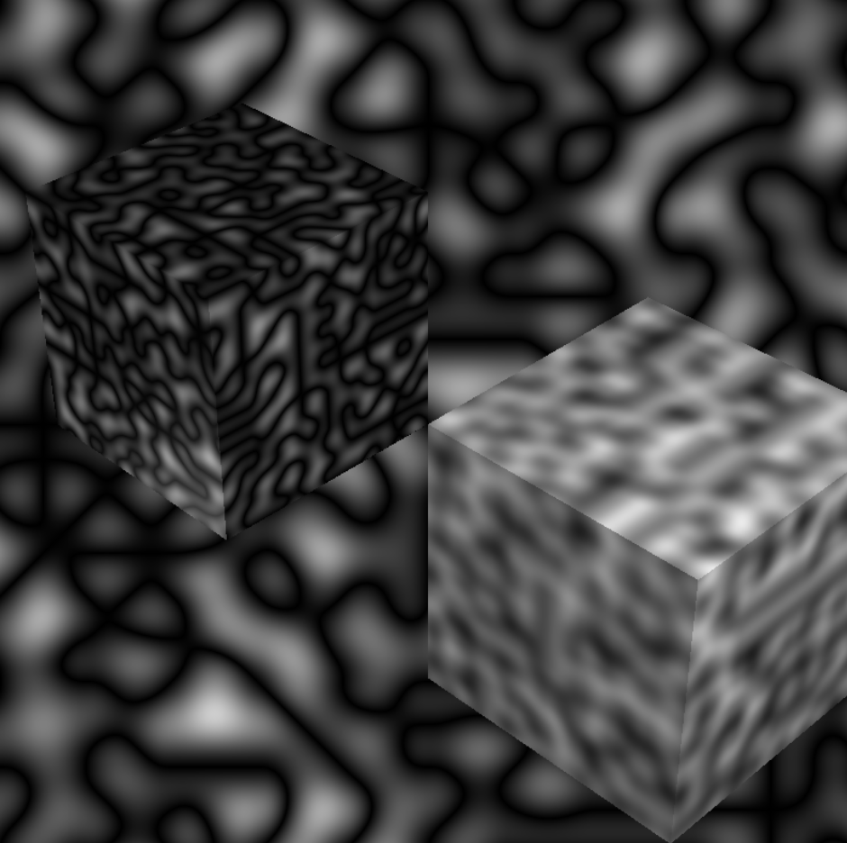
  <figcaption></figcaption>
</p>
<p align="center">
  
  <figcaption></figcaption>
</p>

Then I tried checkerboard, which looked like this. 
It was because I was using ``viewing_ray.pos + viewing_ray.dir``. I then changed it to use the texel coordinates with `z=0`.

<p align="center">
  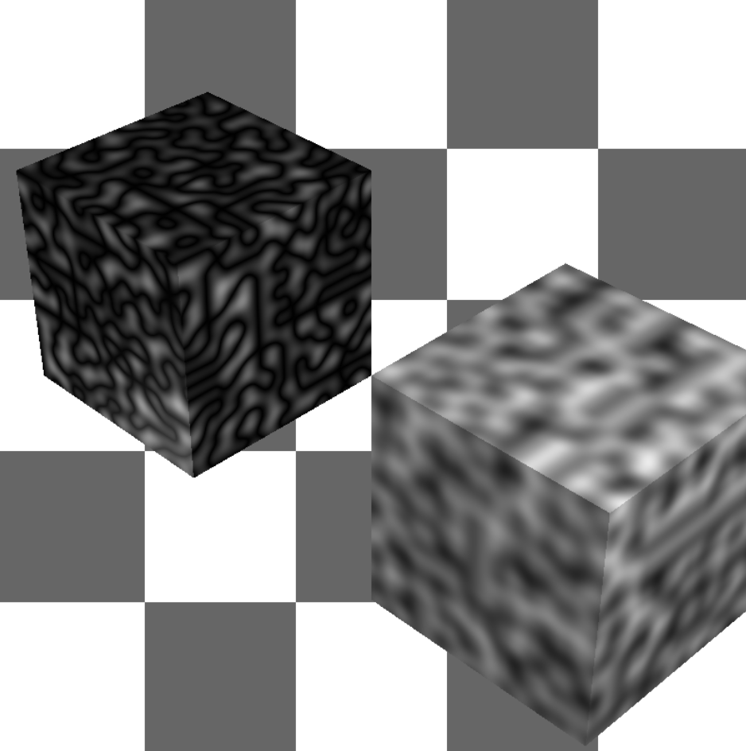
  <figcaption></figcaption>
</p>

## Displacement Mapping

We implement two types of displacement mapping, normal replacement and bump mapping.
Mainly, we will be talking about the getTexturedNormal function here.

### Normal Replacement

- Step 1: get the texture colour
- Step 2: Turn the colour into a normal vector
```c++
Vec3r locNormal(textureColor.r * 2- 1.0 , textureColor.g * 2 - 1.0 , textureColor.b *2 - 1.0 );
locNormal = locNormal.normalize();
```

- Step 3: Get the tangent and bitangent (i.e. the orthonormal basis we will be using)

- Step 4: Apply the orthonormal basis to the texture normal we got at step 2
```c++
for (int i = 0; i < 3; i++)
    for (int j = 0; j < 3; j++)
        NewN[(Axes) i] += locNormal[(Axes) j] * onb[j][(Axes) i];
```

I overloaded the [] operator so 0 -> x, 1 -> y, 2 -> z. This enables me to use loops (and use `=` instead of `+=` to add to the difficulty of debugging).

**Debugging:**

- **getBitan:** (in Sphere) Instead of using the local x y and z vertices, I directly used the global vertex coordinates. Which, of course, did not work.
I now do the following `Vertex v_local = v_global - center`.
- **ComputeBitan:** Oh boy. This was a long one. Turns out I was multiplying my matrices in the wrong row-column order.
Moreover, I had this consistent mistake where I would use `=` instead of `+=` which got rid of all the accumulation in my loops.

If there is a mistake to be made, you can be sure that I am making it.

I also would like to note that I had **less** issues in this homework than in the previous ones. I just did not have time to write them to my blog previously because debugging took so long. But now that I am quite content with the code I already have. It is way easier to debug and make additions.

There are some slight differences in the normal mapping. 
There is no difference I saw in grayscale ones though, which is really interesting to me. 

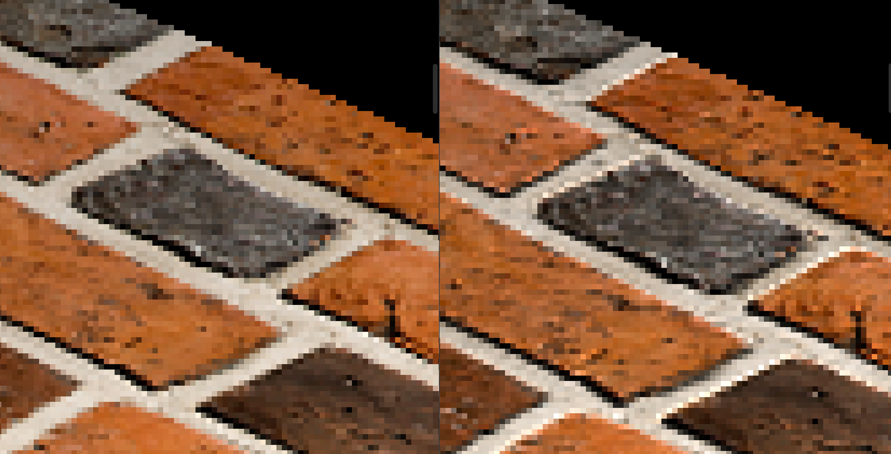
I guess my normal mapping looks flatter. I am not sure but since it does not show up on grayscale I'm choosing my eyesight.
Which is already in terrible situation.

(I lied I fixed it, I was again normalizing my tangents.)

There is this ever so slight difference but let it be.

### Bump Mapping

- **Image:** For images,
  1. Get T and B
  2. Get the floored texel of the vertex.
  3. Get the grayscale results for the texel we are on, +1 in x-axis and +1 in y-axis.
  4. `dv = (n_up - n_curr)* NormalTexture->bumpFactor`. Same for dv with n_right.
  5. `q_u = T +n * du`. Same for `q_v` and `B`.
  6. New normal = q_v x q_u
  7. If the new normal is flipped, multiply it with -1.
  ```c++
  NewN = (dot_product(NewN, n) < 0) ? -NewN : NewN;
  ```
- **Noise:** For Perlin Noise,
  1. Get T and B and choose an epsilon (I chose 0.0001)
  2. Compute the gradient (onb[0] = T and onb[1] = B). Computing the difference one way or two ways didn't make much difference to me. But I thought two ways was more true so kept it this way.
  ```c++
    real dhT = (h(v + onb[0]*epsilon) - h(v - onb[0]*epsilon)) / (2*epsilon);
    real dhB = (h(v + onb[1]*epsilon) - h(v - onb[1]*epsilon)) / (2*epsilon);
  ```
  3. Compute `g_perp`
  ```c++
  Vec3r g_perp = onb[0] * dhT + onb[1]*dhB;
  ```
  4. Compute the new normal by subtracting `g_perp` multiplied with bump factor from the initial normal.
  
<p align="center">
  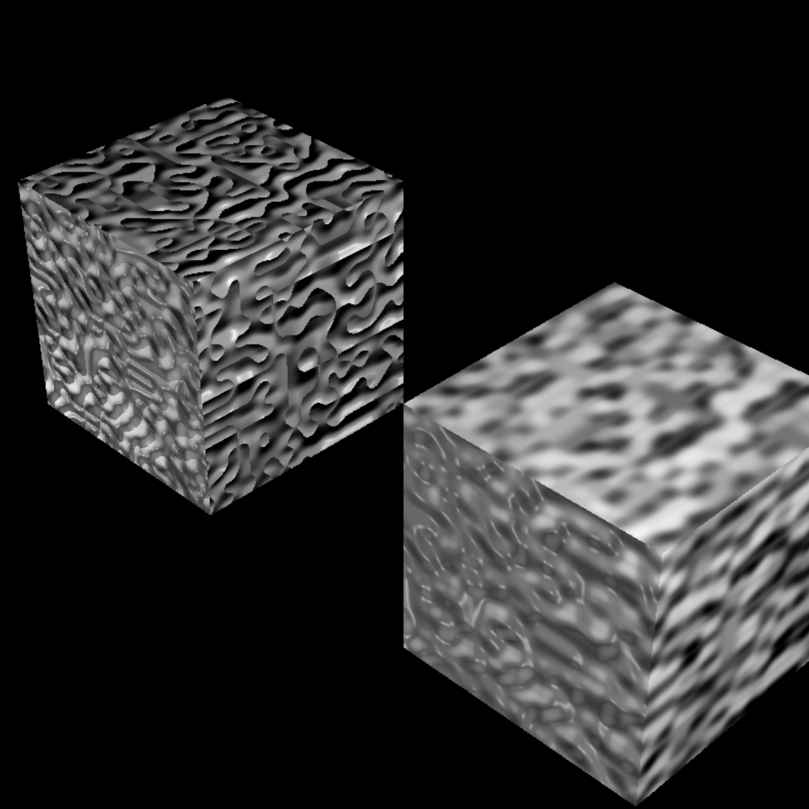
  <figcaption></figcaption>
</p>

- **Debugging Image Textures**
<p align="center">
  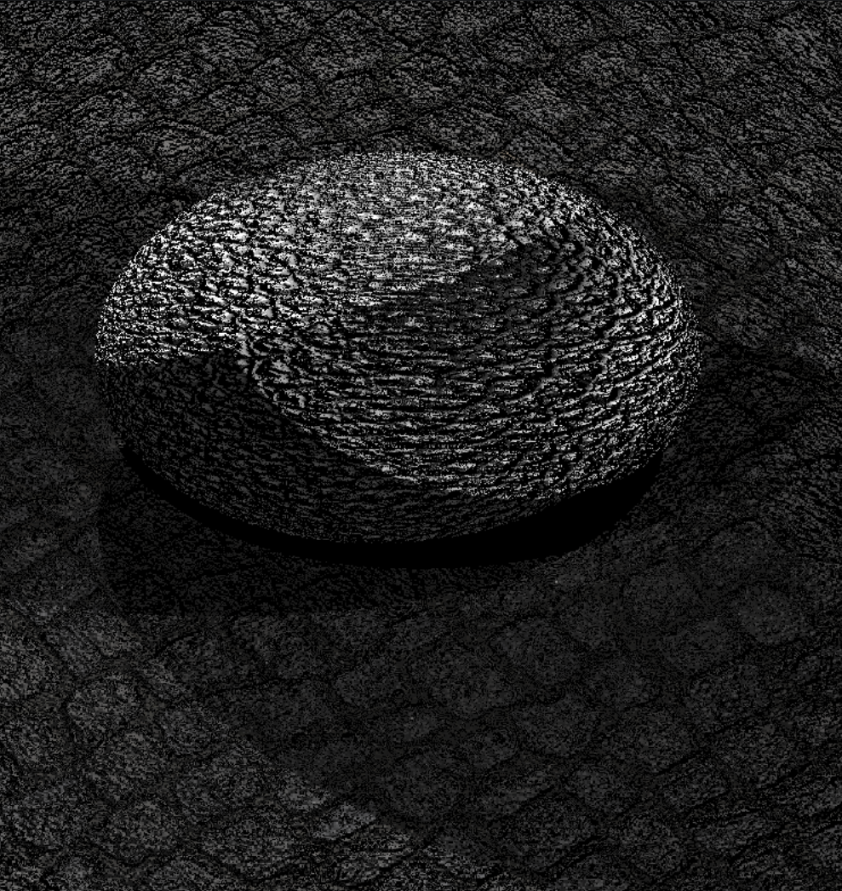
  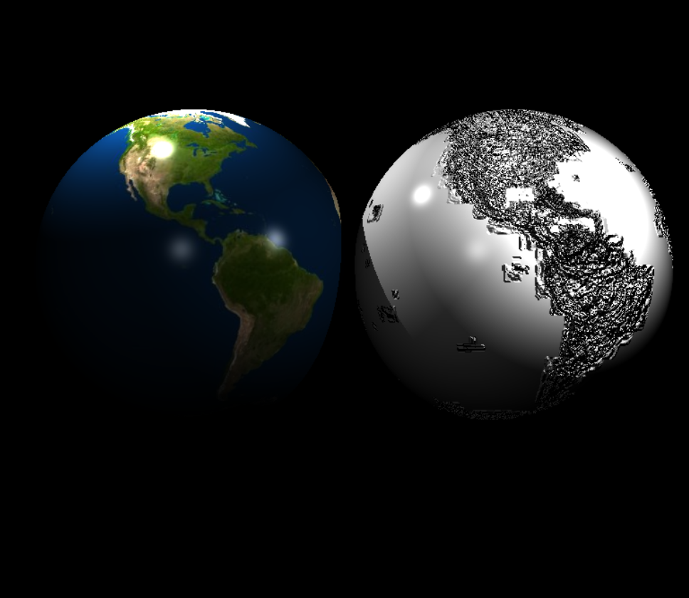
</p>
Truly an artistic rendition. You can't deny. 

Initially I was trying to do image bump mapping according to the vertices, not texels so I rewrote the image part.

After long trial and error sessions I managed to find my issue. The main problem was that I was normalizing B and T vectors. It got fixed when I stopped normalizing them specifically in image bump maps.


After fixing bump mapping in other scenes this scene also mostly got fixed. But somehow I ruined the background?
I did fix it but don't remember what was the issue.

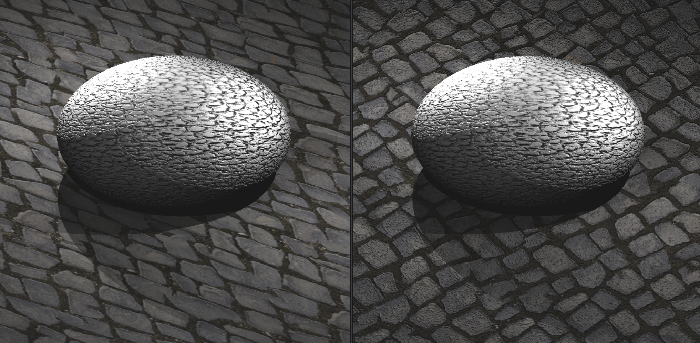
Mine is on the left.

- **Debugging Noise Textures**
<p align="center">
  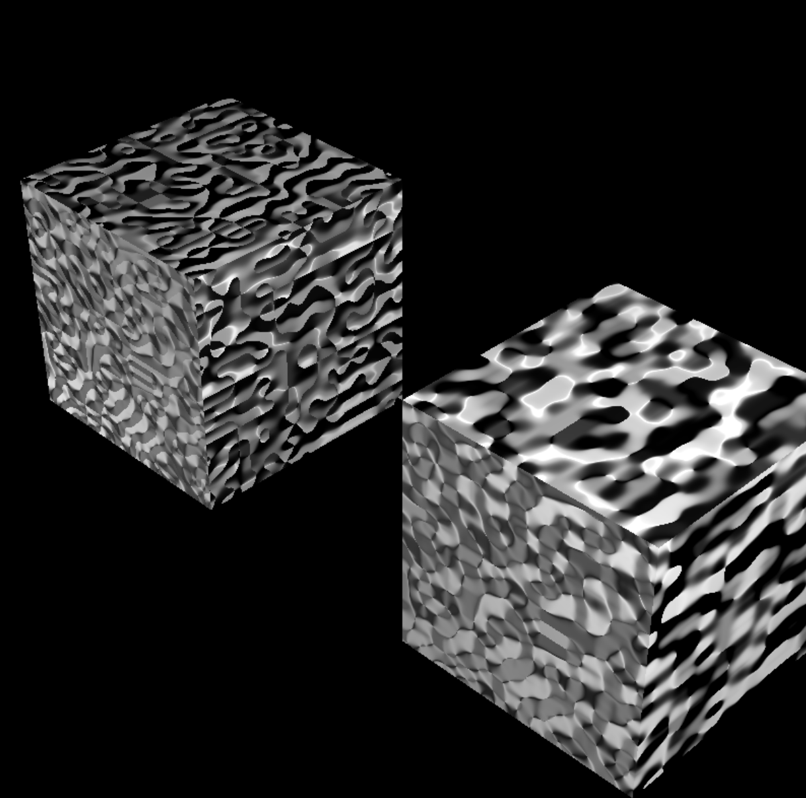
  
</p>

The left picture was the result of me forgetting to multiply with the bump factor.

The main mistake I was making on the right was normalizing `g_perp`. Below is the final correct version:
```c++
Vec3r g_parall  = n *dot_product(dh,n);
Vec3r g_perp    = dh - g_parall;
NewN = n - g_perp* NormalTexture->bumpFactor;
```
Because normalizing is a reflex at this point. 

Let's see what the tunnel of doom looks like-
<p align="center">
  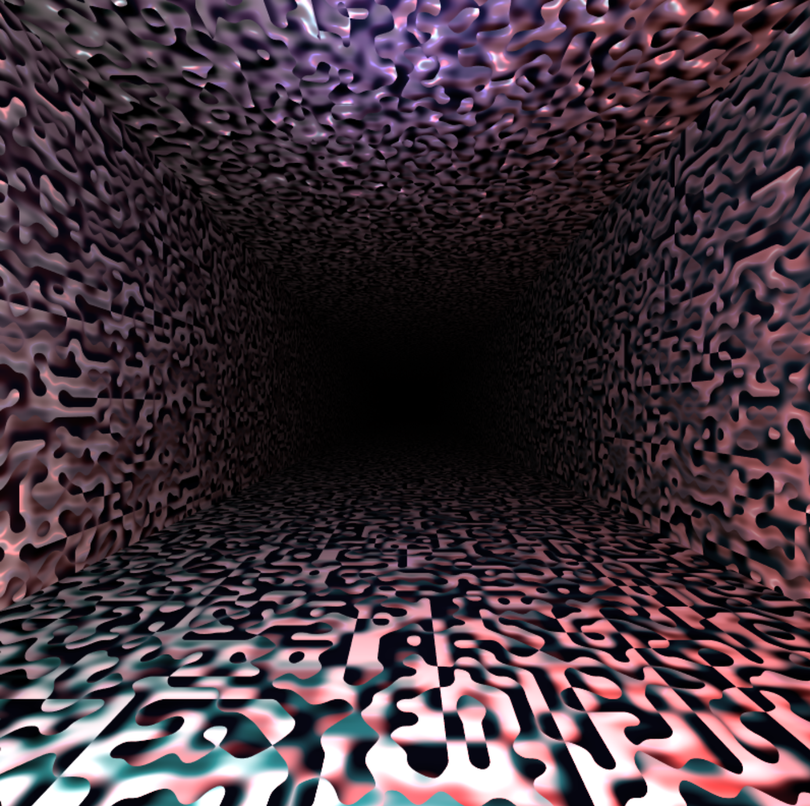
</p>

Oh god I thought I had fixed it.

So the problem was the following:
1. It was a plane, not a triangle
2. This meant the T and B computed were from ONB computations (normalized) and were really big
3. This resulted in `g_perp = { 0.3, 0.0, 0.98}` when `n={0,1,0}`
4. This meant that my g would basically punch my normal to the side.

How to fix this then? I also realized my computation was really open to such flaws so I rewrote that part (for the 3289th time).

I was computing delta x by moving the point along t in every direction, delta y with B and delta z with the normal. What was I thinking, I do not know.
I then computed delta h with T and B separately and combined it as such:

```c++
g_perp = onb[0] * dhT + onb[1]*dhB;
```

Which mimics texel coordinates I believe.

This fixed it :)
<p align="center">
  
</p>


After this, I came across black patches on my dynamic galactica scene.

Turns out I was not handling the case of zero determinant while computing my tangents and they were returned as nan as a result.
I discarded the zero determinant cases and just returned the original normal for such cases.

# Mipmapping

Mipmapping is handled at three different sections.
1. **Computation of Rate of Change:** I compute this directly below the hit record normal computation (only if the object has a texture with trilinear interpolation). I store the rate of change in hit record.
   1. Compute viewing ray for (x+1,y) and (x,y+1)
   2. Intersect them with the plane that is defined by intersection point and normal.
   3. Compute the differences of the intersections to the original intersection at hand.
        ```c++
      Vec3r dP_di = ax - a;
      Vec3r dP_dj = ay - a;
      ```
   5. `A = [ T B ]`
   4. From A, dP_di and dP_dj; discard the axis that the normal is most prominent in.
   6. Take inverse of A. W now have a 2x2 matrix A_inv and two 1x2 matrices dP_di and dP_dj.
   7. Multiply A with both 1x2 matrices separately.
   8. Compare the magnitudes of both results. Choose the result with the bigger magnitude as the rate of change.
 2. **Computation of Level:** This is computed at the object class right before calling the TextureColor function.
    ```c++
        MipMap &mip0 = AllTexture->image->mipmaps[0];
        real a = rate_of_change.u * mip0.width;
        real b = rate_of_change.v * mip0.height;
        real level = 0.5 * log2(a*a + b*b);
    ```
3. **Trilinear Interpolation:** This is computed at the texture level where the interpolation function of the ImageTexture is called.
   1. Get the floor and floor+1 of the level
   2. Get fetch bilinear texture color for both
   3. Interpolate them according to the level.

Welcome to my debugging gallery. Below you can find my paintings.
<p align="center">
  
</p>
Highway to hell.

<p align="center">
  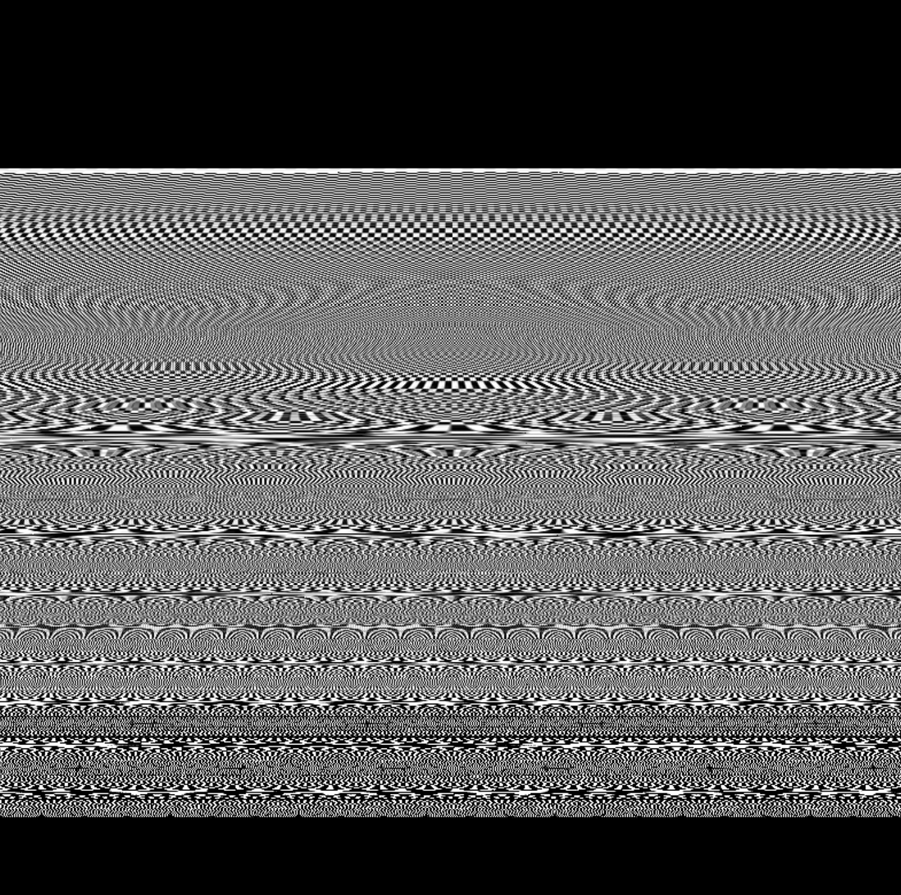
</p>
mipmapping fractals


I needed to get the Colour information from the ``bilinear`` function and not directly from the vector. 
After doing that it worked flawlessly. Yes, no big errors no frustrating debugging, no rewrites. I can't believe this, you can't believe this. None of us can.

# Final
In the end, most things are perfect except octaved perlin noise, replace_normal and of course my dielectrics. 
And I did not try to optimize much so my code did get really slow at certain aspects.

Turns out implementing textures includes endless minor problems. In the previous homeworks the problems were big and global. This time, they were small and scene-specific.