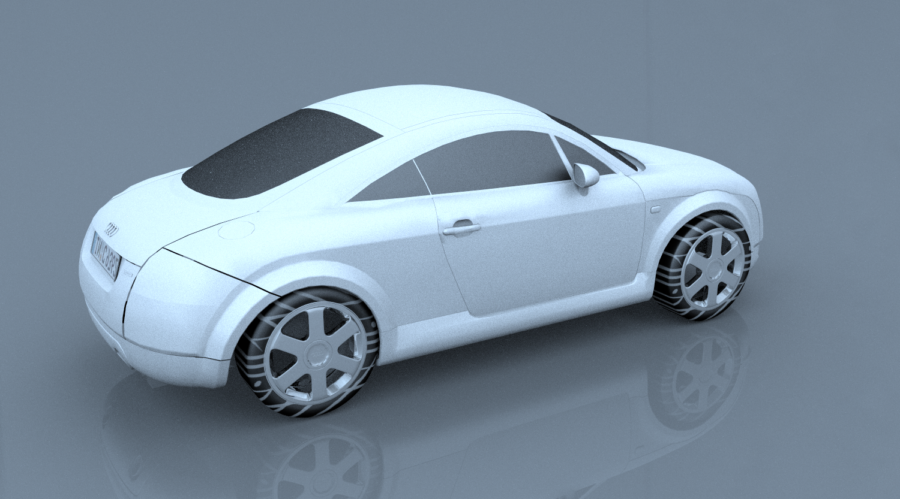
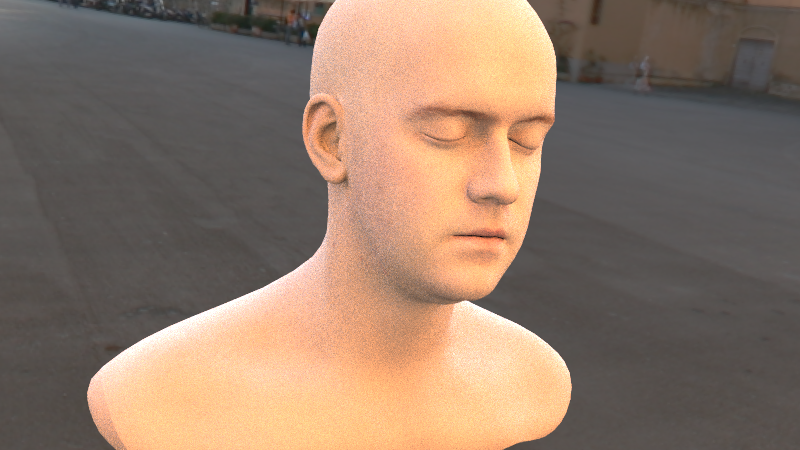
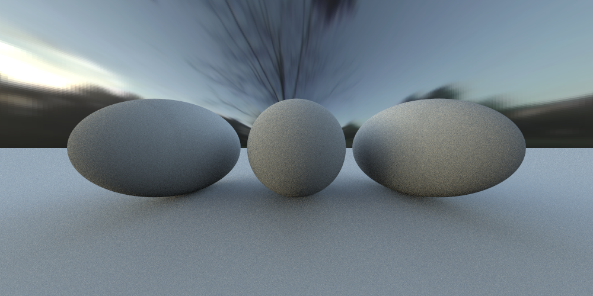
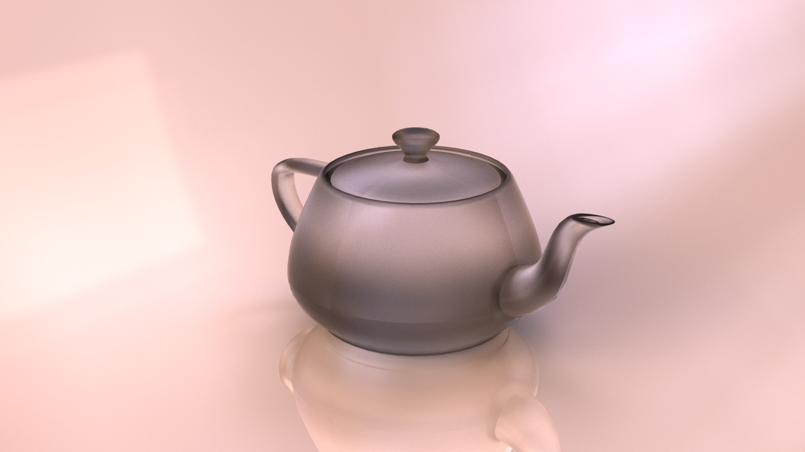
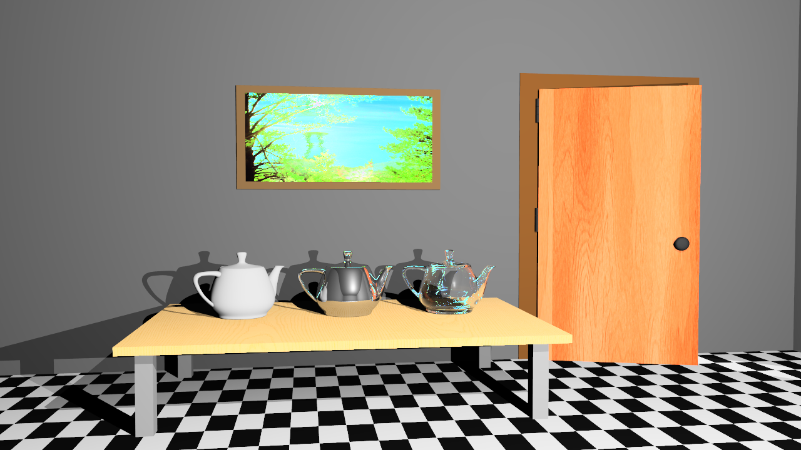
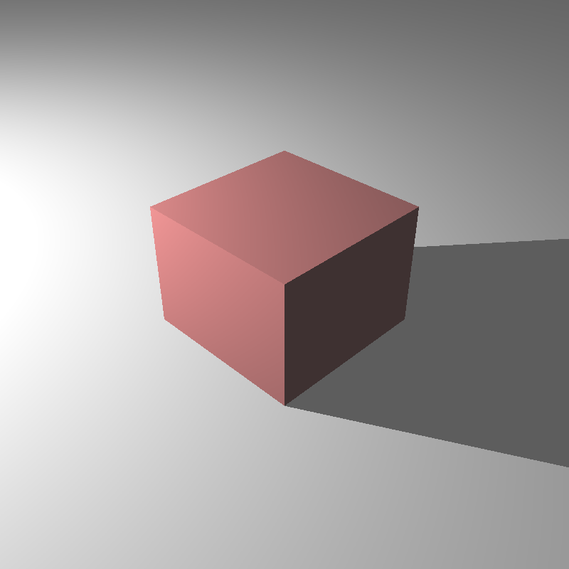
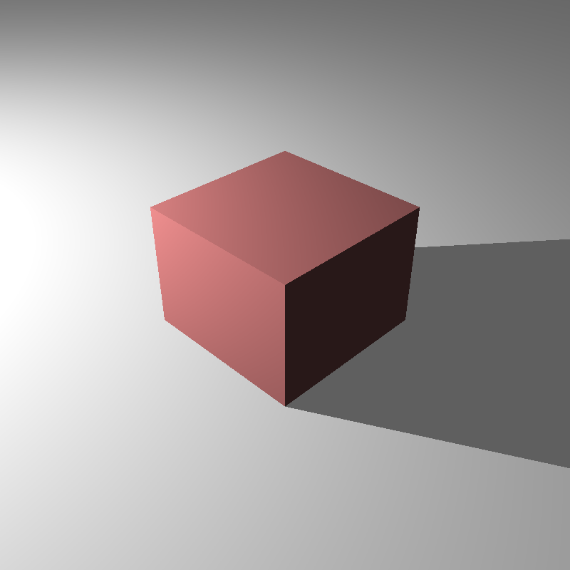
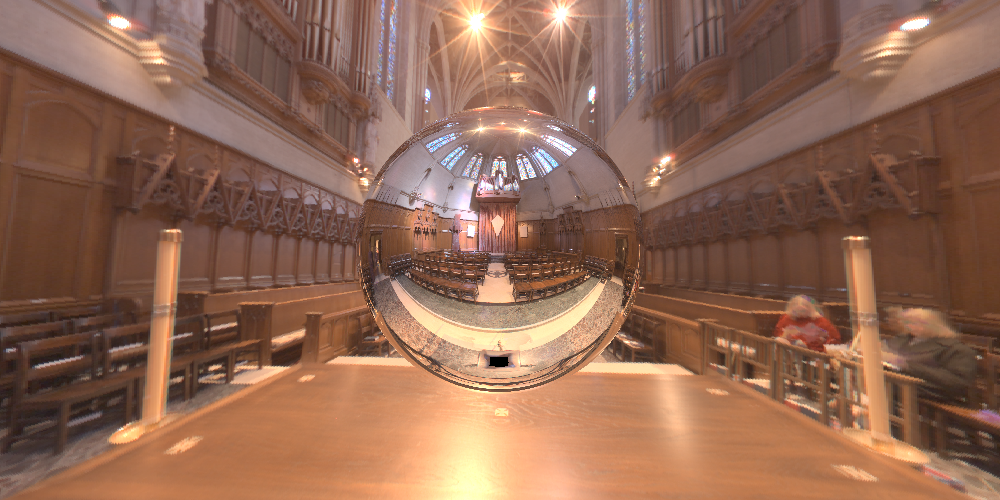

<h1>
  
  CENG795 HW5: Let there be Light
</h1>

This homework's scope includes:
* Directional and Spot Lights
* Tonemapping, burnout
* Environment Lights
* Handling hdr images

It is quite focused. Unlike textures which are apparently still a problem. Truly a worthy opponent for dielectrics.

# File Handling
For hdr files, I continue to use stb library. Yet for exr files (read/write) I used tinyexr. While coding for writing to exr, I followed the sample code here
https://gitlab.liris.cnrs.fr/tpickles/instant-ngp-tomography/-/tree/master/dependencies/tinyexr

# Lights
So the point light class is now entirely a light class with virtual methods:
* Get light type
* Get irradiance at
* Compute Shadow ray direction
And with a common function: Compute shadow ray.

As childe classes we have:
* Area light
* Directional Light
* Spot Light
* Texture Light

## Directional Lights
All we have is a direction and intensity. As the shadow ray direction, we use "-direction". I used to compute the shadow ray direction as light-intersection and would say a point was under shadow by checking if t was in between (0,1).
For directional lights I needed to change this. I added a distance parameter and now check if t<distance. For directional lights distance is infinity.

There is nothing else really.

## Spot Lights
After multiple attempts that ended up as failures because somehow I failed to grasp the concept, I managed to do it.

<p align="center">
  
  <figcaption></figcaption>
</p>

I initially tried to get the angle to compare with coverage and fall off angles by taking the dot product of the shadow ray and the surface normal.

One, it should've been shadow ray and the spotlight direction. Two, this gives me cosine so I should've compared with the cosines of the other angles as well.

But that is not enough, since as the angle gets bigger, the cosine gets smaller I also needed to change the unequalities.

But alas, I made it. Everything works very nice now.

<p align="center">
  
  <figcaption></figcaption>
</p>

## Environment Lights

This class have several attributes:
* An Image texture
* The type of the texture light
* Type of the sampler

**Compute Shadow Ray Direction:** We get a random vector. Depending on the sampler, we either do uniform sampling or cosine sampling. Both are quite straightforward.

**Getting irradiance:** We get a texel according to the shadow ray's direction (chosen random vector). This texel selection depends on the type of the texture light. It can be probe or latlong.
With the texel we got we call the "TextureColor" function of the image texture to get the intensity. 
We then divide the intensity by the p(d) depending on our sampler. And that's it.

To see the light as the background, we use our viewing ray to compute the texel and simply fetch the according colour.

## Tonemapping

So this is where I talk about my Camera class.

### Camera Class

This class is not just a camera class. But it is the precomputed samples class. It is the class that holds the information about the image.
* **Camera class:** Holds the camera position and alignment and the image plane information. Moreover, the tonemaps vector is here. It also holds pointers for camera samples and camera image instances, one for each.
* **CameraImage Class:** Holds the information of the image. The hdr image, ldr image, width, height, image name.
* **CameraSamples Class:** Holds the precomputed samples.

Okay, now we can move on with the tone mapping.

### ToneMapping Class
Each tonemap instance holds its own data pointer and image name string as well as other tonemap related variables (gamma, TMOtype, saturation, key, burnout...)

This is where we will be applying tone mapping.

So I want to talk about an interesting thing I came across. As in texture homework, I tried to hold TMO as a function. Yet whenever I called that function as a member variable, every attribute of the class was garbage. It was as if the function did not act as if it belonged to the original class instance but instead a non-existing one.
So I scrapped that and stuck with my if-elses.
0. Compute middle grey.
```c++
    constexpr real eps = 1e-6;
    real total = 0.0;
    int len = luminances.size();
    for (int i = 0; i < len; i++)
    {
        total += log(eps + luminances[i]);
    }
    return exp(total / len);
```
1. Take the luminance of the colour
2. `Yi_keyed = (key / camera_image->middle_grey) * Yi`
3. Apply the TMO and get the Yo.
4. Now its time to get the new colour from Yo: ``output = Yo * pow(inp / Yi, saturation)``
5. Then clamp the color so that it is between [0,1].
6. Apply gamma correction and then multiply by 255.
7. Round to the nearest integer.

Now let's talk about the TMOs. 
**Photographic:** There are two options, one with burnout and one without.
1. (Without)  `L / (L + 1.0)`
2. (With) `L * (1 + L / (white_point * white_point)) / (1 + L)`

**ACES:** Apply the ACES map function. 

**Filmic:** Apply the filmic map function.
Then apply the same map function to the white point and divide the prior result by the latter.

"But how do you compute the white point?" I'm glad you asked. 
The burnout value within each `ToneMap` class acts as a percentage. 
We compute (100-burnout)% ant find the index that corresponds to it.

I then compute every luminance value and sort them from smallest to largest.
The value at the previously computed index is our white point instead of the highest luminance point when there is no burnout.
It is also important to apply the key to the white point luminance.

# Some Notes
Overall, it was a lot more straightforward homework I believe. When I solved one problem of the scene the others were solved as well.
Not textures, never the textures. 

Here are some of the scenes that I'd say worked:
<p align="center">
  
  <figcaption></figcaption>
</p>

<p align="center">
  
  <figcaption></figcaption>
</p>

<p align="center">
  
  <figcaption></figcaption>
</p>
And here are the problems:

Here is my teapot with reduced samples:
<p align="center">
  
  <figcaption></figcaption>
</p>
Oh sorry this is not mine.

<p align="center">
  
  <figcaption></figcaption>
</p>

This is. Important to make the distinction.


I have no idea what is going on with veach ajar scene since for other scenes I had no problem with colours and tonemapping. What is more freaky is my dielectric isn't even as broken as this image suggests. 
Truly some dark magic is going on here. Maybe due to my degamma application but that is not enough to explain everything.

<p align="center">
  
  <figcaption></figcaption>
</p>

Here is my problematic degamma:

<p align="center">
  
  
</p>


I say degamma because I did not have any issues with my other scenes:

<p align="center">
  
</p>

This homework felt fairly easier. Maybe because I gave up on veach ajar for now. I just don't have any idea this time. Maybe it will come to me with time as I continue working on the raytracer.

This is the end of the blog :)

